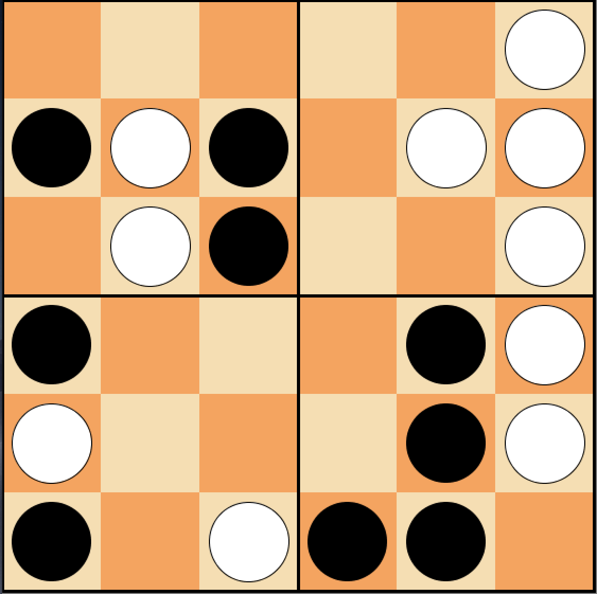

# Pentago-AI
## Theoretical Basis and Motivation
Monte Carlo Tree Search is used by the AI agent to pick the best move to play. MCTS was selected as the agent’s primary game playing strategy due to the cheap computational cost of each MCTS iteration. The agent is able to maximize the number of statistics produced within the allotted time, thus using its resources more efficiently relative to other game playing algorithms, such as minimax. Further, as the number of legal moves decreases as a Pentago game progresses, more statistics can be generated for a given move towards the end of the game, allowing the agent to only make better choices as the game is played. Using MCTS allows the agent to use a statistical approach to game playing, avoiding the use of the computationally-heavy evaluation functions used by minimax.

I was inspired by the three phases of a chess game – the opening, the middle, and the end game. Hence, the agent uses a pre-determined opening strategy to take advantage of the early open board, MCTS for the bulk of the middle game, and pre-processed end game strategies loaded from a file. Defense mechanisms are implemented to avoid relying on statistics for when the opponent approaches a possible win. With MCTS, my agent operates efficiently, while allowing time to adequately assess whether a separate strategy is to be applied depending on the board state.

